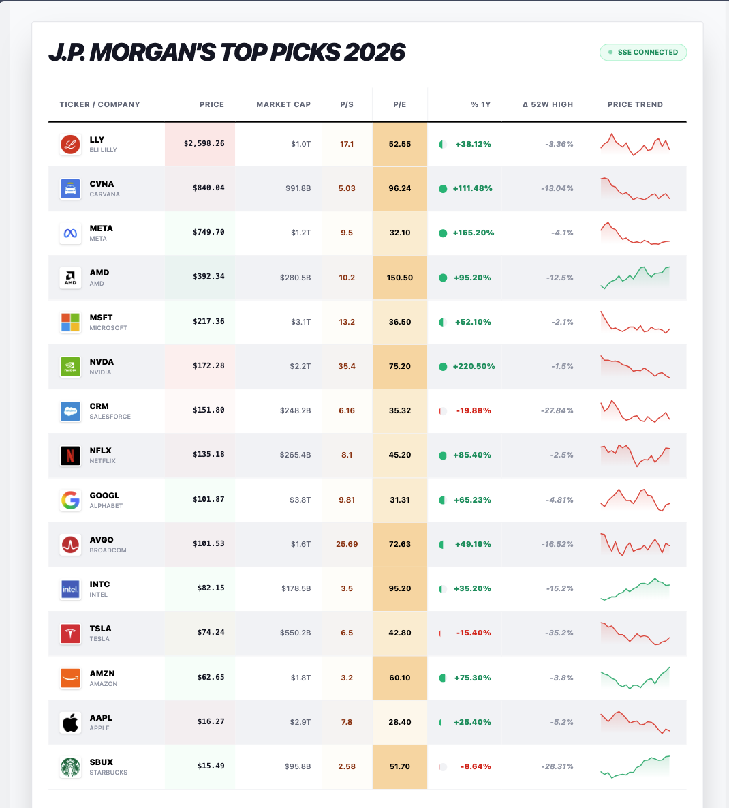

# Real-time Stock Table (SSE)



A real-time stock dashboard built with SvelteKit, featuring live updates via Server-Sent Events (SSE).

## Features

- ⚡ **Live Updates**: Real-time stock price updates using Server-Sent Events (SSE).
- 🔄 **Dynamic Sorting**: Auto-sorts stocks by price (High to Low) with smooth FLIP animations.
- 🎨 **Visual Feedback**: Real-time visual cues (green/red flashes) for price changes.
- 🖼️ **Company Logos**: Integration of real company logos with robust fallback handling.
- 📊 **Status Monitoring**: Connection status indicators (Connecting, Open, Closed).

## Tech Stack

- **Framework**: SvelteKit (Svelte 5 Runes system)
- **Styling**: TailwindCSS
- **Data Handling**: TanStack Table (Headless UI)
- **Real-time**: Server-Sent Events (SSE)
- **Deployment**: Vercel

## Project Structure

```
src/
├── lib/
│   ├── components/
│   │   ├── CompanyLogo.svelte   # Reusable logo component with fallback
│   │   ├── Sparkline.svelte     # SVG-based sparkline chart
│   │   └── StockTable.svelte    # Main data table with SSE integration
│   ├── server/
│   │   └── stocks.ts            # Mock stock data generator
│   └── table.svelte.ts          # Svelte 5 reactive table adapter
├── routes/
│   └── api/
│       └── stocks-sse/          # SSE Endpoint for real-time updates
```

## Developing

Once you've created a project and installed dependencies with `npm install` (or `pnpm install` or `yarn`), start a development server:

```sh
npm run dev

# or start the server and open the app in a new browser tab
npm run dev -- --open
```

## Building

To create a production version of your app:

```sh
npm run build
```

You can preview the production build with `npm run preview`.

## Deployment

This project is configured with `@sveltejs/adapter-vercel` for seamless deployment to Vercel.

### Deploying to Vercel

1. **Push to GitHub**: Ensure your code is pushed to a GitHub repository.
2. **Import Project**: Go to [Vercel Dashboard](https://vercel.com/dashboard) and click "Add New... > Project".
3. **Select Repository**: Choose your GitHub repository.
4. **Deploy**: Vercel will automatically detect the SvelteKit framework and optimized build settings. Click "Deploy".

The `svelte.config.js` is already set up to use the Vercel adapter:

```js
import adapter from '@sveltejs/adapter-vercel';

export default {
    kit: { adapter: adapter() }
};
```

### Deploying via CLI

You can also deploy directly from your terminal using the Vercel CLI:

```sh
# Install Vercel CLI globally
npm i -g vercel

# Login to Vercel
vercel login

# Deploy to preview (development)
vercel

# Deploy to production
vercel --prod
```
